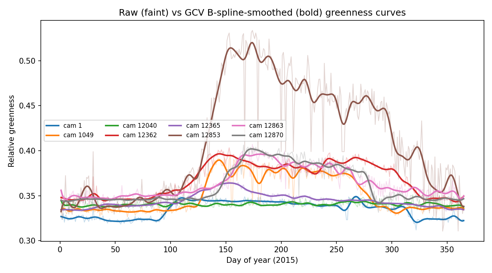
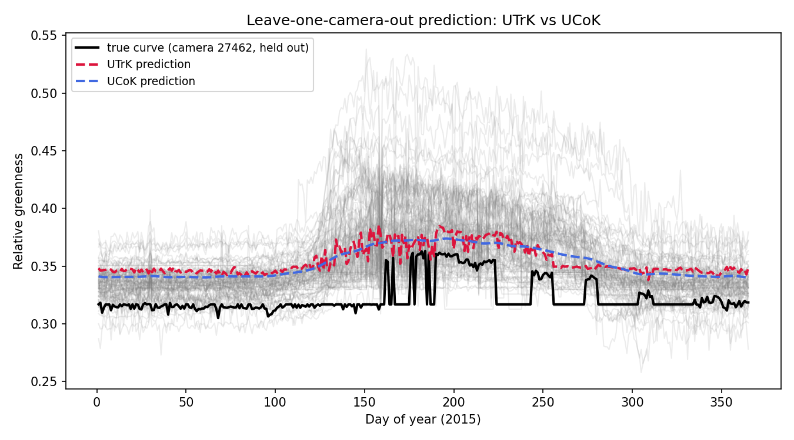

# greenness

A Python reproduction of the functional-data-analysis + universal-kriging pipeline from:

> Hosseini, R. (2024). **Exploring Universal Kriging Modelling for Functional Greenness Data Captured by Digital Webcams.** ICSTA 2024 Proceedings.
> [ICSTA_174.pdf](https://www.avestia.com/ICSTA2024_Proceedings/files/paper/ICSTA_174.pdf)

The original analysis was implemented in R. This repository contains two parallel R codebases plus a Python port:

- [`R/`](R/) — a clean, documented rewrite of the analysis (`00_setup.R` … `08_figures.R`), organized as one pipeline stage per file with roxygen-style function docs.
- [`src/greenness/`](src/greenness/) — the same method ported to open-source Python (numpy / scipy / pandas), starting from the compiled daily greenness time series and reproducing every modelling step described in the paper.

The original, exploratory R scripts this analysis started from are kept privately outside this repository rather than published here. The notes below describe what they contained and what was found while rewriting them, for provenance, without including the scripts themselves.

## What this is about

[AMOS](http://amos.cse.wustl.edu/) webcams across the US capture daily images of outdoor scenes. A "greenness index" — the relative amount of green in an automatically-selected region of interest — is extracted per image, giving one noisy daily greenness curve per camera per year. This project treats each camera's yearly greenness trace as a **functional data object** and asks: *can we predict the greenness curve at a camera-less location, using only the curves and coordinates of nearby cameras?*

Two spatial predictors are compared, matching the paper:

- **UTrK — Universal Trace-Kriging**: fit a single scalar "trace" variogram directly on the raw greenness curves (semivariance = mean squared functional difference between camera pairs at a given distance), then krige with the resulting weights applied directly to the curves.
- **UCoK — Universal (Co)Kriging of FPC scores**: reduce each curve to a handful of varimax-rotated functional principal component (FPC) scores, krige each score independently across space, then reconstruct the predicted curve from the kriged scores.

Both are evaluated with a Monte Carlo leave-out study (random train/test camera splits, RMSPE per held-out camera), matching the paper's evaluation.

## Method map: R (original, private) → R (clean) → Python

| Step | R original (private, not in this repo) | R clean (`R/`) | Python (`src/greenness/`) |
|---|---|---|---|
| Package/path setup | scattered `library()` calls per script | [`00_setup.R`](R/00_setup.R) | package imports in each module |
| Raw AMOS image download (upstream, not reproduced in Python) | `myfunctions.R`, `Greenness_loading.R` | [`01_data_acquisition.R`](R/01_data_acquisition.R) | — |
| Load per-camera CSVs, clean, impute → (day × camera) matrix | `SpatialTemporalGreenness.R`, `Functional Analysis for year 2015.R` | [`02_load_and_clean_data.R`](R/02_load_and_clean_data.R): `load_greenness_dataset()` | [`greenness.data.build_dataset`](src/greenness/data.py) |
| B-spline smoothing, GCV-selected penalty | `Lambda_GCV`, `Smooth_GVS` (`fda::create.bspline.basis`, `fdPar`, `smooth.basis`) | [`03_functional_smoothing.R`](R/03_functional_smoothing.R): `gcv_lambda_search()`, `smooth_greenness_gcv()` | [`greenness.smoothing`](src/greenness/smoothing.py) |
| Functional PCA + varimax rotation | `pca.fd`, `varmx.pca.fd` | [`03_functional_smoothing.R`](R/03_functional_smoothing.R): `rotated_fpca()` | [`greenness.fpca`](src/greenness/fpca.py) |
| UTrK / UCoK prediction | `Fit_Utrk`, `Fit_Ucok_rpc` (`my_kriging_functions.R`) | [`04_kriging_models.R`](R/04_kriging_models.R): `fit_utrk()`, `fit_ucok()` | [`greenness.kriging`](src/greenness/kriging.py) |
| Monte Carlo RMSPE evaluation | `generate.path`, `generate.path_2` | [`05_monte_carlo_evaluation.R`](R/05_monte_carlo_evaluation.R): `run_monte_carlo_study()` | [`greenness.evaluate`](src/greenness/evaluate.py) |
| End-to-end example run | `UCoK& UTrK.R` | [`06_run_analysis_2015.R`](R/06_run_analysis_2015.R) | `scripts/run_pipeline.py` |
| Optimal new-camera sampling design (extension, not in the paper) | `Sampling_functions.R`, `Sampling-Kriging.R`, `UCOK_sampling.R` | [`07_optimal_sampling_design.R`](R/07_optimal_sampling_design.R) | — |
| Figures (raw vs. smoothed curves) | *(ad hoc plotting code scattered in `To_check_2015.R`)* | [`08_figures.R`](R/08_figures.R): `plot_smoothed_curves()` | `scripts/make_figures.py` |

### R code review: bugs found and fixed

While rewriting the private original scripts into the clean `R/` scripts, two real bugs surfaced and were fixed (both were pre-existing in the original code, not introduced by the Python port):

1. **`Fit_Utrk()` / `Fit_Ucok_rpc()` discarded their predictions.** In the original `my_kriging_functions.R`, both functions had a leftover debugging `return(Var_Utrk)` / `return(Sigma2_Ucok)` after the real result line (e.g. `# return(Result_Utrk)`), so only the kriging *variance* was ever returned — the predicted curves were computed but thrown away. Fixed in [`fit_utrk()` / `fit_ucok()`](R/04_kriging_models.R), which now return both `prediction` and `variance`.
2. **`generate.path()` referenced an object that was never assigned.** `RMSPE_fun2` computed `sqrt(mean((test[,x] - Ucok_forecasted[[1]][,x])^2))`, but `Ucok_forecasted` was never created in that scope (the actual UCoK fit was stored under a different name, `cok2_forecasted` / `Ucok2_forecasted`) — running this as-is would raise an "object not found" error. Fixed in [`monte_carlo_iteration()`](R/05_monte_carlo_evaluation.R), which threads the real `fit_ucok()` return value through consistently.

Two further original scripts, `Sampling-Kriging.R` and `UCOK_sampling.R`, depend on the external `spsann` package and reference objects (`candi1`, `SA_sampling_2`, `train`, `S_coordinates`) that are never defined in-file — they do not run as-is. Rather than guess at the missing pieces, [`07_optimal_sampling_design.R`](R/07_optimal_sampling_design.R) reimplements the same idea (simulated-annealing search for the variance-minimizing new-camera location) as a small, self-contained annealer with no undefined references.

A fourth, data-driven issue (not a code bug, but worth documenting) surfaced when actually running the clean scripts against the real data: a handful of AMOS cameras share an exact `(lat, lon)` with another camera (e.g. 1306 and 1593), which makes the kriging covariance matrix exactly singular (`solve(): system is exactly singular`) whenever both end up in the same fit. `load_greenness_dataset()` now nudges duplicate-location cameras apart by a negligible, reproducible random offset (≤ 1e-4°, ~10 m) as its final cleaning step — see `jitter_duplicate_coordinates()` in [`02_load_and_clean_data.R`](R/02_load_and_clean_data.R).

*Provenance note:* the original analysis never hit this error, but not because it was handled in code — comparing the original `Greenness_loading.R`'s broad 100-camera list (`camera_vec`) against the original `SpatialTemporalGreenness.R`'s trimmed 95-camera analysis list (`new_cameras_collection`) shows the latter is missing exactly five IDs: `1593`, `21745`, `21757`, `21759`, `21791` — precisely one camera from each of the five duplicate-coordinate pairs, and nothing else. So the original workflow sidestepped the singularity by hand-curating the camera list *before* it reached the kriging step, rather than by any reusable dedup/jitter logic. `02_load_and_clean_data.R` instead fixes this generically (keeps all cameras, nudges the duplicates), so it stays correct even if the raw data changes; set `jitter_duplicate_coords = FALSE` and manually exclude those five IDs if you need an exact camera-for-camera match to the original 95.

### A bug introduced by this rewrite (not in the original), found via testing

Unlike the four issues above, this one was not present in the original scripts — it was introduced while writing the clean `04_kriging_models.R` and only surfaced once the scripts were actually run against real data (this environment has no R interpreter, so the initial rewrite could only be checked by hand; see the caveat at the top of this section). In good conscience this needs to be called out as clearly as the others: `fit_ucok()` built `predicted_scores` with `vapply(score_forecasts, function(f) f$Forecast, numeric(nrow(new_coords)))`. `vapply()`/`sapply()` only return a matrix when each call produces a result of length > 1; when `new_coords` has exactly one row (a single held-out camera — exactly what the `06_run_analysis_2015.R` demo does), each call returns a length-1 result, so R silently collapses the output to a flat vector instead of a 1-row matrix. `t()` of that flat vector then has the wrong orientation, and `harmonic_vals %*% t(predicted_scores)` fails with "non-conformable arguments". Multi-camera calls (e.g. every Monte Carlo iteration) never hit this, since `nrow(new_coords) > 1` there. Fixed by building `predicted_scores` / `score_variance` with `do.call(cbind, ...)` instead, which always keeps the `(n_test x n_components)` shape regardless of how many test points there are.

**Note:** these `R/` scripts were reviewed line-by-line and are believed correct, but could not be executed in the environment used to write them (no R interpreter was available there). Please run `source("R/06_run_analysis_2015.R")` locally as a sanity check before relying on them.

Two implementation details are carried over from the R code deliberately, and documented here so results are interpretable:

1. **"Universal" kriging = constant drift only.** The R code calls `estimateDrift("~.", g, Intercept = TRUE)` with no extra covariates, so the estimated drift is just a global mean. That makes the "universal" kriging here mathematically equivalent to **ordinary kriging** with a global constant trend — this Python port reproduces exactly that, rather than a more general polynomial-drift universal kriging.
2. **"Co"kriging = independent per-score kriging.** `predictFstat(..., .type = "UcoK", algIndependent = TRUE)` krige's each rotated FPC score on its own variogram, not via a true multivariate cross-covariance model. This port does the same (`fit_ucok` loops over components independently) — a natural extension would be a full linear model of coregionalization, noted as a possible future improvement.

## Data

Raw data lives in [`data/raw/`](data/raw/):

- `greenness_curves/DFcamera{1..100}new.csv` — one file per camera ("case"), with day-of-year and relative greenness for 2013 / 2014 / 2015 (not every camera has all three years).
- `CameraID.csv` — maps each case number (1–100) to its real AMOS camera ID.
- `amos_locations.xlsx` — `camera_id, lat, lon` for the full AMOS network; only the ~100 cameras used here are relevant.

`scripts/run_pipeline.py` assembles these into a tidy (365-day × N-camera) matrix and geo-references it. Out of the 100 cameras with 2015 curves, **87 have matching coordinates** in the locations table used here (13 camera IDs — e.g. `1308`, `8221`, `18404` — have no entry in `amos_locations.xlsx`); the paper reports working with 90 of the original 95 cameras after its own quality-control pass. This is a known, minor discrepancy worth double-checking against the original data if exact camera-count parity matters for your use case.

A cleaned, ready-to-use copy is also saved at `data/processed/greenness_2015.csv` (365 × 87, raw NaNs preserved) and `data/processed/coords_2015.csv`.

The raw AMOS *image* pipeline (downloading webcam photos and extracting the greenness index via the uRoI method) is **not** reproduced in Python — it's upstream of what the paper itself describes. The Google Drive downloader is kept as clean, documented R in [`R/01_data_acquisition.R`](R/01_data_acquisition.R), based on the private original `myfunctions.R` / `Greenness_loading.R`.

## Repository layout

```
greenness/
├── R/                              # clean, documented R rewrite (source in numeric order)
│   ├── 00_setup.R                  #   packages, paths, shared constants
│   ├── 01_data_acquisition.R       #   AMOS/Google Drive raw image download (upstream, optional)
│   ├── 02_load_and_clean_data.R    #   load_greenness_dataset(): load, outlier-drop, LOCF impute
│   ├── 03_functional_smoothing.R   #   gcv_lambda_search(), smooth_greenness_gcv(), rotated_fpca()
│   ├── 04_kriging_models.R         #   fit_utrk(), fit_ucok()
│   ├── 05_monte_carlo_evaluation.R #   run_monte_carlo_study(), summarize_monte_carlo()
│   ├── 06_run_analysis_2015.R      #   end-to-end example run (source 00-05 first)
│   ├── 07_optimal_sampling_design.R#   extension: simulated-annealing new-camera placement
│   └── 08_figures.R                #   plot_smoothed_curves(): raw vs. smoothed curve figure
├── paper/                  # the published paper (PDF)
├── data/
│   ├── raw/                # per-camera CSVs, camera ID map, AMOS locations
│   └── processed/          # tidy combined greenness matrix + coordinates
├── src/greenness/          # the Python package
│   ├── data.py
│   ├── smoothing.py
│   ├── fpca.py
│   ├── variogram.py
│   ├── kriging.py
│   └── evaluate.py
├── scripts/
│   ├── run_pipeline.py     # end-to-end demo: load -> smooth -> FPCA -> UTrK/UCoK -> MC RMSPE
│   └── make_figures.py     # regenerates the figures in results/
├── results/                # example output figures
├── tests/                  # sanity tests (run with pytest)
└── requirements.txt
```

## Getting started

### Python

```bash
python -m venv .venv && source .venv/bin/activate    # optional but recommended
pip install -r requirements.txt

python scripts/run_pipeline.py      # loads data, smooths, fits UTrK/UCoK, runs a small MC check
python scripts/make_figures.py      # regenerates results/*.png
pytest tests/                       # sanity tests
```

### R

```r
# install.packages(c("dplyr", "tidyr", "readr", "purrr", "tibble", "readxl",
#                     "openxlsx", "ggplot2", "naniar", "imputeTS", "fda",
#                     "fda.usc", "gstat", "sp", "googledrive", "jpeg"))
# remotes::install_github("ogru/fdagstat")

setwd("greenness")                        # repository root
source("R/06_run_analysis_2015.R")        # sources 00-05 itself and runs the full example
source("R/08_figures.R")                  # reuses greenness/smoothed from above; saves the smoothed-curves figure
```

`06_run_analysis_2015.R` prints the number of cameras retained after cleaning, the GCV-selected
lambda, the rotated-FPCA variance explained, a single leave-one-camera-out RMSPE comparison
(saved to `results/utrk_vs_ucok_example_R.pdf`), and a small 5-iteration Monte Carlo summary.
`08_figures.R` additionally saves `results/smoothed_curves_2015_R.png` (raw vs. GCV-smoothed
curves for a sample of cameras) — the R-side equivalent of the Python port's first figure. For
the full 300-iteration study across all four training fractions, call `run_monte_carlo_study()`
directly (see [`05_monte_carlo_evaluation.R`](R/05_monte_carlo_evaluation.R)) — it takes
considerably longer than the smoke test.

Example output from `run_pipeline.py`:

```
1) Loading data...
   greenness matrix: 365 days x 87 cameras
2) Smoothing with GCV-selected lambda (nbasis=90, norder=6)...
   selected lambda = 562.3
3) A single held-out-camera UTrK/UCoK prediction sanity check...
   held-out camera 30300: RMSPE UTrK=0.00654  UCoK=0.01189
4) Small Monte Carlo evaluation (5 iterations, 80% train)...
 mean_RMSPE_UTrK  mean_RMSPE_UCoK
        0.018934         0.018477
```

### Example figures

`results/smoothed_curves_2015.png` — raw vs. GCV-smoothed greenness curves for a sample of cameras:



`results/utrk_vs_ucok_example.png` — a leave-one-camera-out prediction, UTrK vs UCoK against the true (held-out) curve:



## Running the full Monte Carlo study

The paper runs 300 Monte Carlo iterations at several training fractions (m = 0.5, 0.6, 0.7, 0.8). To reproduce that:

```python
from greenness.data import build_dataset
from greenness.evaluate import monte_carlo_rmspe, summarize

curves, coords = build_dataset("data/raw/greenness_curves", "data/raw/CameraID.csv", "data/raw/amos_locations.xlsx")

mc = monte_carlo_rmspe(
    curves, coords,
    train_frac=0.8, n_iter=300, seed=2024,
    utrk_kwargs=dict(model="Exp", n_lags=100, max_dist=60),
    ucok_kwargs=dict(nbasis=100, norder=6, n_components=3, model="Sph"),
)
print(summarize(mc))
```

This is computationally heavier (300 kriging + FPCA fits) — expect it to take a while longer than the 5-iteration smoke test in `run_pipeline.py`.

## Citation

If you use this code, please cite the original paper:

```bibtex
@inproceedings{hosseini2024greenness,
  title     = {Exploring Universal Kriging Modelling for Functional Greenness Data Captured by Digital Webcams},
  author    = {Hosseini, Raziyeh},
  booktitle = {ICSTA 2024 Proceedings},
  year      = {2024},
  url       = {https://www.avestia.com/ICSTA2024_Proceedings/files/paper/ICSTA_174.pdf}
}
```

## License

[MIT](LICENSE) — see the LICENSE file. The paper PDF in `paper/` is included for reference/provenance and remains under its own copyright.
